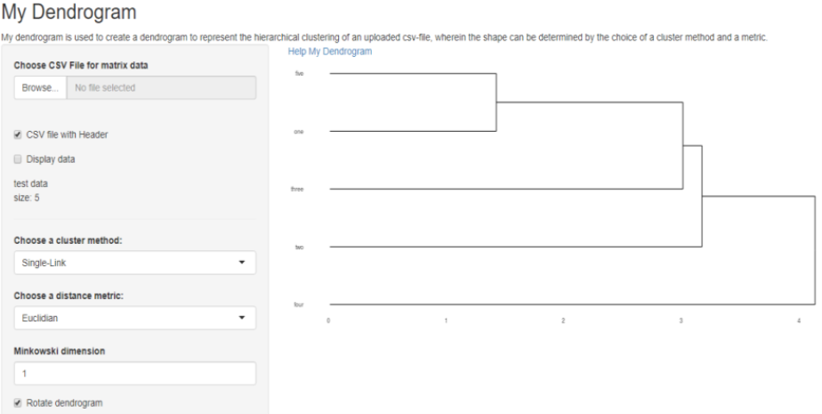

## Presentation Dendrogram

In order to gain an initial overview of unknown data, it is often useful to cluster and visualize the clusters. A first possibility is hierarchical clustering and a presentation in a dendrogram.

- The following Shiny application is used to create a dendrogram to represent the hierarchical clustering of a data frame.
- Initially, a test set of 5 data sets is displayed, which illustrates the presentation.
- The application user has the option of uploading his data from a csv file.
- After uploading, the number of records will be displayed as "size".
- The uploaded data is clustered and displayed as a dendrogram on the right. The dendrogram can be rotated.
- The creation of the hierarchical cluster can be defined by changing the metric and the method of clustering.
- Optionally, the user can view the csv data below the dendrogram.

--- 

## Plot Dendrogram

Website https://apwi.shinyapps.io/my_dendrogram/




```
## Error in appshot.shiny.appobj(structure(list(httpHandler = function (req) : appshot of Shiny app objects is not yet supported.
```

---

## Explanation: Selection Parameters

* Box for "Choose CSV File" :
  Via a dialog window, a csv file can be selected and uploaded.

* Checkbox for "CSV file with Header" :
  If the csv file has a header, the checkbox should be selected.

* Checkbox for "Display data" :
  The checkbox allows the user to display the data under the Dendrogram.

* Selection list for a "Choose a cluster method" :
  The following procedures are offered: "Single-Link", "Complete Link", "Average-Link", "Median-Link" or "Centroid link".

* Selection list for a "Choose a distance metric" :
  The following metrics are offered: "Euclidean", "Manhattan", "Minkowski" or "Binary".

* For the Minkowski metric an additional dimension can be chosen.

* Further Information :                                                               
Website https://cran.r-project.org/web/packages/ggdendro/vignettes/ggdendro.html

--- 

## Test Data and Clustering

```
##       x y
## one   2 6
## two   4 9
## three 5 6
## four  3 2
## five  1 7
```

Enclosed the clustering with the leaves and the gradual union including the heights.

```
## --[dendrogram w/ 2 branches and 5 members at h = 5]
##   |--leaf "four" 
##   `--[dendrogram w/ 2 branches and 4 members at h = 4]
##      |--leaf "two" 
##      `--[dendrogram w/ 2 branches and 3 members at h = 3]
##         |--leaf "three" 
##         `--[dendrogram w/ 2 branches and 2 members at h = 2]
##            |--leaf "one" 
##            `--leaf "five"
```

